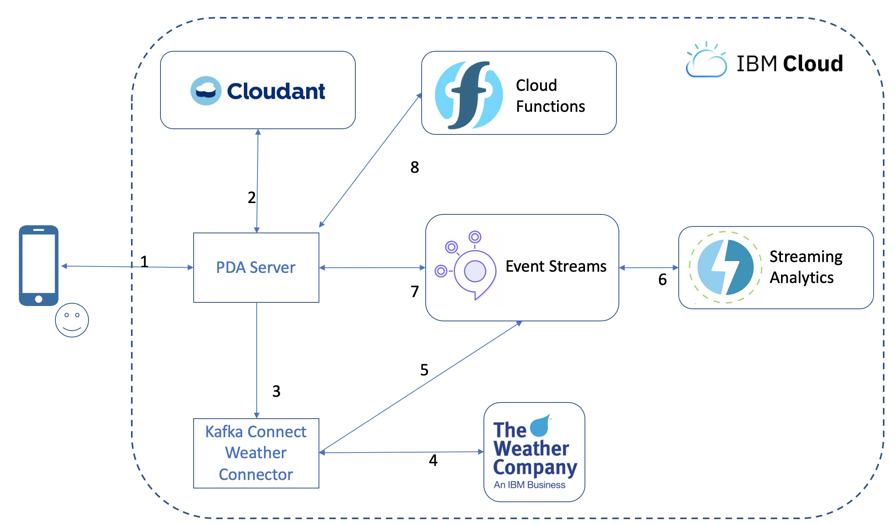

# Solution roadmap

So far, we've only developed a proof of concept to validate how the solution would work and identify the area that needed extra thinking. This has allowed us to confirm such a solution is feasible. We've also been able to get feedback from a few subject matter experts and gain confidence this project would actually help people affected by a disaster both physically and mentally.

The next steps would be to first gather expert recommendations for each type of disaster and include that in the action generation logic. Then the proof of concept web application would need to be turned into a mobile application with support for low battery usage and an offline mode.

As the solution is designed using very scalable services (Event Streams, Cloudant) we expect the current architecture to be able to be deployed at scale and cover large populations.

# Solution design

1. User starts the PDA application and registers
2. User information are stored
3. PDA starts a Kafka Connect Weather Connector instance
4. The connector will regularly fetch weather forecast for the user location
5. The connector pushes the weather data to Event Streams
6. IBM Streams consumes the weather data, identifies natural disasters and pushes an event back to Event Streams
7. PDA consumes disaster events
8. PDA generates personalized todos
